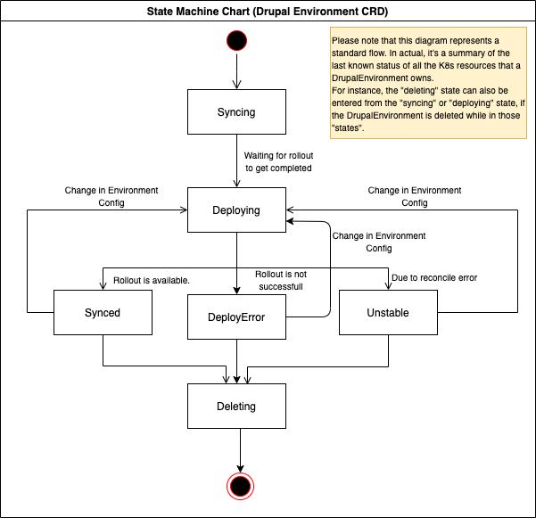

# Drupal Application Operator
[](https://travis-ci.com/acquia/fn-drupal-operator) [](https://coveralls.io/github/acquia/fn-drupal-operator)

This application is built utilizing the Operator SDK, and provides several controllers which orchestrate the Kubernetes
hosting infrastructure necessary to serve Drupal applications.

This operator supports running environments within an Istio service mesh.  To read more about the requirements and behavior around this, read more [here](docs/istio.md).

## Prerequisites

1. Download and install operator-sdk v0.15.0: [operator-sdk](https://github.com/operator-framework/operator-sdk)

## Cluster Dependencies

### Argo Rollouts

The Kubernetes cluster must have Argo Rollouts installed. Check if Argo Rollouts is properly deployed:

```bash
$ kubectl get crd | grep rollout
rollouts.argoproj.io

$ kubectl get -n argo-rollouts deployment
NAME            DESIRED   CURRENT   UP-TO-DATE   AVAILABLE   AGE
argo-rollouts   1         1         1            1           38m
```

If it is not, install it:

```bash
kubectl create ns argo-rollouts
kubectl apply -n argo-rollouts -f https://raw.githubusercontent.com/argoproj/argo-rollouts/v0.5.0/manifests/install.yaml
```

## Controllers

### Drupal Environment Controller

The `DrupalEnvironment` Controller manages Kubernetes resources needed to provide a hosted Drupal environment (as in
"dev", "stage", "prod", etc.). Its Custom Resource Definition is contained in `deploy/crds/fnresources.acquia.io_v1alpha1_drupalenvironment_crd.yaml`.

The `DrupalEnvironment` Controller creates `Deployment`s and `Service`s for "Drupal" pods containing Apache and PHP-FPM.
`ConfigMap`s and `Secret`s are created to hold configuration for Apache, PHP, and PHP-FPM. A `HorizontalPodAutoscaler`
is created to automatically scale the "Drupal" `Deployment` to handle fluctuations in load.

### Site Controller

The `Site` Controller manages Kubernetes resources needed to serve a Drupal site from within a given Drupal environment.
Its Custom Resource Definition is contained in `deploy/crds/fnresources.acquia.io_v1alpha1_site_crd.yaml`.

The `Site` Controller creates an `Ingress` for the site, and configures the "domain map" `ConfigMap` and `Secret`, which
contain the Drupal Multisite mapping and DB credentials, respectively.

`Job`s to be run can be added to a `Site` Custom Resource as annotations. The `Site` Controller will manage the running
of these `Job`s. `CronJob`s to run periodically can also be added to a `Site` by using the `Site.spec.crons` field. See
`deploy/crds/fnresources.acquia.io_v1alpha1_site_cr.yaml` for examples of both of these.

### Database Controller

The `Database` Controller manages database related Kubernetes resources.
Its Custom Resource Definition is contained in `deploy/crds/fnresources.acquia.io_v1alpha1_database_crd.yaml`.

Successful database configuration requires that a Database custom resource contains valid host and port for a backend database, along with a reference to an `AdminSecret` secret within it's spec. The `AdminSecret` must exist and contain credentials that can access backend database for db/user creation.
`Database` custom resource also contain a `UserSecret` field within it's spec. A secret with this name is created by the controller and populated with a randomly generated password used to configure MySQL user for site. The generated `UserSecret` is used by `Site` controller to populate the DB map secret.
If the database admin secret does not exist the database controller will assume that the database is pointing to a valid backend database.

#### Admin Secret

Example:

```
apiVersion: v1
kind: Secret
metadata:
  name: admin-secret
  namespace: sitens
type: Opaque
stringData:
  password: {MySQL Admin Password}
  username: {MySQL Admin User}
```

You can create this Secret from the command line by running (from within the Site's namespace): 

```bash
kubectl create secret generic wlgore-admin-secret \
  --from-literal=username=$ADMIN_USER --from-literal=password=$ADMIN_PASSWORD
```

## Namespaces in this file
Some of the example commands in this file omit the --namespace or -n option. It's assumed that the operator will be
deployed into the `-n acquia-polaris-system` namespace. This can be ensured by first using the `kubens` command:

```bash
kubens -n acquia-polaris-system
```

## Build

1. Install operator-sdk v0.15.0
   - MacOS `brew install operator-sdk`
1. Clone repo
1. Build and push a Docker image containing the operator:

    ```bash
    your_image_tag=SOMETHING UNIQUE
    operator-sdk build 881217801864.dkr.ecr.us-east-1.amazonaws.com/fn-drupal-operator:${your_image_tag} \
      && docker push 881217801864.dkr.ecr.us-east-1.amazonaws.com/fn-drupal-operator:${your_image_tag}
    ```

## Deployment on EKS Cluster

1. Generate a local Helm chart:

    ```bash
    cd helm
    ./package.sh
    ```

1. Deploy the Helm chart:

    ```bash
    helm install --name fn-drupal-operator --namespace acquia-polaris-system ./fn-drupal-operator \
      --set image.tag=${your_image_tag}
    ```

    If you want the Operator to only watch a specific Namespace, that can be specified by adding the command line option:

    ```bash
    --set watchNamespace=${namespace_to_watch}
    ```

1. Monitor the logs with:

    ```bash
    kubectl logs -f -n acquia-polaris-system fn-drupal-operator-XXXXXXXXXX-XXXXX
    ```

    or, if you have `jq` installed, you can pretty-print them:

    ```bash
    kubectl logs -f -n acquia-polaris-system fn-drupal-operator-XXXXXXXXXX-XXXXX \
      | while read -r line ; do echo ${line} | jq -crRC '.' ; echo "" ; done
    ```

## Local Development Using a Remote Kubernetes Cluster (or `kind` Cluster)

Edit your `/etc/hosts` file to point the mysql.default.svc.cluster.local hostname to `127.0.0.1`.

You can then compile and run your local operator code by running:

(Note: you'll want to run the `kubectl port-forward` command in another shell/tab/tmux window, as it needs to be kept running)

```bash
kubectl port-forward svc/mysql -n default 3306
operator-sdk run --local --namespace "" --kubeconfig $HOME/.kube/your_kubeconfig_file
```

The operator will run locally, but perform all API operations on the cluster specified in the given kubeconfig file. The
main advantages of this are 1) not needing to build a Docker image on every run, and 2) not needing to kill the operator
Pod on the cluster to relaunch your operator build with the new Docker image.

It should be possible for multiple developers to run the operator on the same remote cluster by specifying different
Namespace values on the `--namespace` parameter. That way, each operator will only watch for `DrupalEnvironment` and `Site`
Custom Resources in the given namespace, and won't interfere with each other. (Specifying `--namespace ""` causes the
operator to watch Custom Resources on all Namespaces on the cluster.)

### Pretty-printing Operator Logs with `jq`

If you have the `jq` CLI utility installed locally, you can (mostly) pretty-print the JSON-based log output that comes from
the operator. For a deployment of the Operator on a remote cluster, use a command similar to:

```bash
kubectl logs -f fn-drupal-operator-xxxxxxxxxx-xxxxx | while read -r line ; do \
  echo $line | jq -rcRC '. as $raw | try fromjson catch $raw' ; echo "" ; done
```

Or, if running the Operator locally, try:

```bash
operator-sdk run --local --namespace "" --kubeconfig $HOME/.kube/your_kubeconfig_file 2>&1 \
  | while read -r line ; do echo ${line} | jq -crRC '. as $raw | try fromjson catch $raw' \
  ; echo "" ; done
```

### Lints

Check all required lints with:

```
make lint
```

Auto-correct lints where possible with:

```
make lint-fix
```

### Unit Tests

Run all unit tests with:

```
make test
```

Generate a local test code coverage report with:

```
make coverage
```

## Local development with `kind`

A running local cluster following the steps available on fn-polaris repository is required for local development:
* [fn-polaris.README](https://github.com/acquia/fn-polaris/blob/master/local/README.md)

### Setup Operators

Run the following commands on `fn-drupal-operator` to set up the operators:

 ```
 cd helm
 ./package.sh
 helm install --name fn-drupal-operator --namespace acquia-polaris-system ./helm/fn-drupal-operator --set useDynamicProvisioning="true"
 ```

Once the custom resource definitions for drupal environment and  site are installed, run the following commands to create a drupal environment and site:

* `kubectl apply -f deploy/crds/fnresources.acquia.io_drupalenvironment_cr.yaml`
* `kubectl apply -f deploy/crds/fnresources.acquia.io_site_cr.yaml`


### Working with controllers

* Find the image name currently deployed:

In order to get the controller changes up and running on the local cluster, run the following command to get the image name:

```
kubectl get deploy fn-drupal-operator -o jsonpath="{.spec.template.spec.containers[0].image}"
```

If above did not work, run below and find the image tag and copy the image name:

```
kubectl get deploy fn-drupal-operator -o yaml"
```

* Build a new image using your local code:

```
operator-sdk build [image name from the above step]:[your custom name for your image]
```

* Push the image to ECR:

```
docker push [image name from the above step]:[your custom name for your image]
```

* Set the image on the fn-drupal-operator deployment:

```
kubectl set image deployment fn-drupal-operator -n acquia-polaris-system \
  fn-drupal-operator=[image name from the above step]:[your custom name for your image]
```

### Verifying the resources

Run the following to get your pods/services or any other custom resource to see the changes up and running:

To get all the pods:

`kubectl get po -A`


To get all the services:

`kubectl get svc -A`

To get drupal applications:

`kubectl get drapp -A`

To get drupal environments:

`kubectl get drenv -A`

To get databases:

`kubectl get databases -A`

To get the sites:

`kubectl get sites -A`

To get commands:

`kubectl get cmds -A`

## Life Cycle of Drupal Environment

1. `Syncing`: This is the `initial` status for the drupal environment, and should be active while waiting for drapp and other resources to get created (i.e. doesn't requeue for any resources). It re-enters this state when Kubernetes resources are out of sync with the DrupalEnvironment's fields, either due to the resources or the fields changing, until it is finished reconciling the differences.
1. `Deploying`: When rollout has `progressing` condition type with Reason as `ReplicaSetUpdated`
1. `Synced`: This status indicates that `argo rollout` has been completed and is healthy. When the minimum no. of drupal pods are up and running & argo rollout is not in progressing state i.e. Argo Rollout's status should have following conditions:
   1.  type `progressing` as **NewReplicaSetAvailable**
   1.  type `available` as **AvailableReason**
1. `Unstable`: occurs when the reconcile loop throws an **error**
1. `DeployError`: occurs when argo rollout fails to deploy.
1. `Deleting`: occurs when deletion is requested.



*The source for this diagram is located in the `Diagrams` folder of the [NextGenCloud team drive]*

[NextGenCloud team drive]: https://drive.google.com/drive/u/0/folders/1uKS2GZic4ZNNXKhq0f-JxecODtJBl6ex

## Publishing a release

See the [shared release tool] documentation. Builds for this project are found on [Travis-CI].

[shared release tool]: https://github.com/acquia/fn-go-utils/blob/master/README.md#Release
[Travis-CI]: https://travis-ci.com/acquia/fn-drupal-operator/builds

## Deploying a release

Published releases should be included in [acquia-polaris-system].

[acquia-polaris-system]: https://github.com/acquia/fn-polaris/tree/master/helm/acquia-polaris-system

### Troubleshooting

#### Mysql

Find the mysql connection info in the yaml file located in local directory in fn-polaris repo.
In order to connect to mysql locally on your machine you need to port forward the mysql service traffic to your local 3306 port:

```bash
kubectl port-forward svc/mysql 33306:3306
mysql -uroot -padmin -h127.0.0.1 -P33306
```

#### Browse the site

In order to visit the site you just created, you can use port forwarding:

```bash
kubectl port-forward svc/drupal 8000:80
```

The site should now be available at http://127.0.0.1:8000

